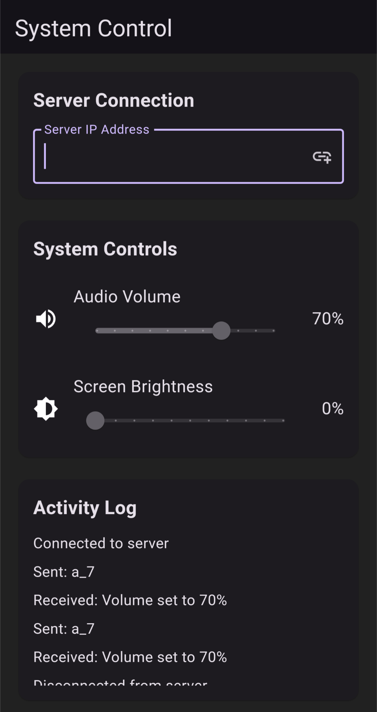

# WebRemote

**WebRemote** is a mobile app that allows you to remotely control your system’s volume and brightness using a WebSocket connection. It pairs seamlessly with the **WebRemoteServer** application running on your computer.

## Features
- **Volume Control**: Adjust your system’s audio volume remotely.
- **Brightness Control**: Adjust your monitor’s brightness remotely.
- **Easy Connection**: Connect to your computer using its IP address.
- **Activity Log**: View real-time logs of all actions and responses.
- **Remember IP**: The app saves the last connected IP address for quick access.

## Prerequisites
Before using **WebRemote**, you need to set up the **WebRemoteServer** on your computer. Follow the instructions in the [WebRemoteServer repository](https://github.com/dreamcatcher45/WebRemoteServer).

## Download and Install
You can download the latest version of the app from the [Releases Page](https://github.com/dreamcatcher45/web_remote/releases).

### Installation Steps:
1. **Download the APK**:
   - Go to the [Releases Page](https://github.com/dreamcatcher45/web_remote/releases).
   - Download the latest `.apk` file.

2. **Install the APK**:
   - Open the downloaded `.apk` file on your Android device.
   - Follow the on-screen instructions to install the app.

3. **Open the App**:
   - Once installed, open the app from your device’s app drawer.

## How to Use
1. **Set Up WebRemoteServer**:
   - Download and install the **WebRemoteServer** application from the [WebRemoteServer repository](https://github.com/dreamcatcher45/WebRemoteServer).
   - Run the `WebRemoteServer.exe` file on your computer.
   - Note the IP address displayed by the server (e.g., `ws://192.168.1.100:8765`).

2. **Connect to Your Computer**:
   - Open the **WebRemote** app on your mobile device.
   - Enter the IP address displayed by the **WebRemoteServer** (Skip PORT number).
   - Tap the connect button to establish a connection.

3. **Adjust Volume**:
   - Use the slider to control the system’s audio volume.
   - The changes will be sent to your computer instantly.

4. **Adjust Brightness**:
   - Use the slider to control the monitor’s brightness.
   - The changes will be sent to your computer instantly.

5. **View Activity Log**:
   - The activity log shows all actions and responses for easy monitoring.

6. **Disconnect**:
   - Tap the power icon in the top-right corner to disconnect from the server.

# Screenshot

## Support
If you have any questions or need help, feel free to [open an issue](https://github.com/dreamcatcher45/web_remote/issues) on GitHub.
